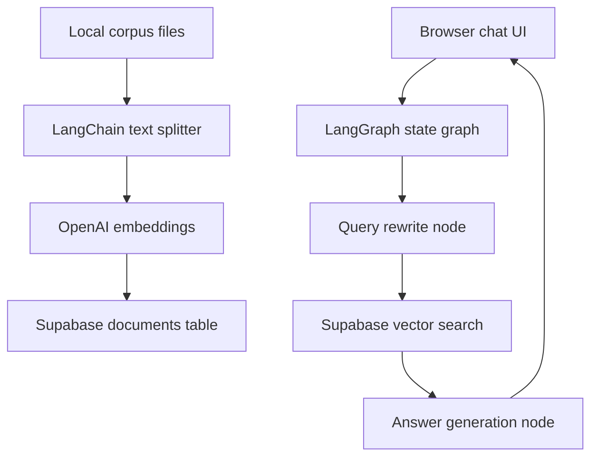

# LangGraph Recruiter Chatbot

A locally hosted browser app that demonstrates:

- LangChain chunking and embedding workflows
- LangGraph state-based orchestration for RAG
- Supabase `documents` storage for vectorized chunks
- A polished browser UI for grounded corpus Q&A

## What this project does

This project lets you point a local folder of text documents at a recruiter-friendly RAG chatbot. It:

1. Reads files from `data/corpus`
2. Splits them into overlapping chunks with LangChain
3. Creates embeddings with OpenAI
4. Upserts them into the Supabase `documents` table
5. Uses LangGraph to rewrite the question, retrieve relevant chunks, and answer with citations

## Architecture



## Stack

- `Next.js` App Router for the local browser app
- `React + TypeScript` for UI and server routes
- `LangChain.js` for chunking and embeddings
- `LangGraph` for the chatbot workflow
- `Supabase` with `pgvector` for retrieval storage

## Supabase setup

Run the SQL in [supabase/documents.sql](supabase/documents.sql) if your table is not already compatible. It creates:

- `public.documents`
- a `chunk_id` unique key for safe upserts
- a `match_documents(...)` RPC function used by retrieval

If you already have a `documents` table, the important fields are:

- `chunk_id text unique`
- `content text`
- `metadata jsonb`
- `embedding vector(1536)`

## Local setup

1. Copy `.env.example` to `.env.local`
2. Fill in your OpenAI and Supabase credentials
3. Install packages:

```bash
npm install
```

4. Start the app:

```bash
npm run dev
```

5. Open [http://localhost:3000](http://localhost:3000)

## Ingesting a real corpus

Add `.md`, `.txt`, `.markdown`, or `.json` files into `data/corpus`, then either:

- click **Ingest local corpus** in the browser UI, or
- run:

```bash
npm run ingest
```

The app tags each chunk with a `datasetId`, which is also used as a metadata filter during retrieval.

## Recruiter demo talking points

- The workflow is not a single prompt chain; it is an explicit LangGraph pipeline with state transitions.
- The UI exposes the rewritten query, retrieved sources, and similarity-based confidence.
- The ingestion path is realistic for large corpora because chunking and embedding are separated from chat-time retrieval.
- Supabase is being used as the vector store layer rather than keeping embeddings in memory.

## Key files

- [src/lib/langgraph/chat-graph.ts](src/lib/langgraph/chat-graph.ts)
- [src/lib/ingest.ts](src/lib/ingest.ts)
- [src/lib/retrieval.ts](src/lib/retrieval.ts)
- [src/components/chat-shell.tsx](src/components/chat-shell.tsx)

## Suggested next upgrades

- Add auth and per-user corpora
- Support PDFs and DOCX loaders
- Stream token responses into the UI
- Add evals for answer grounding and retrieval quality
